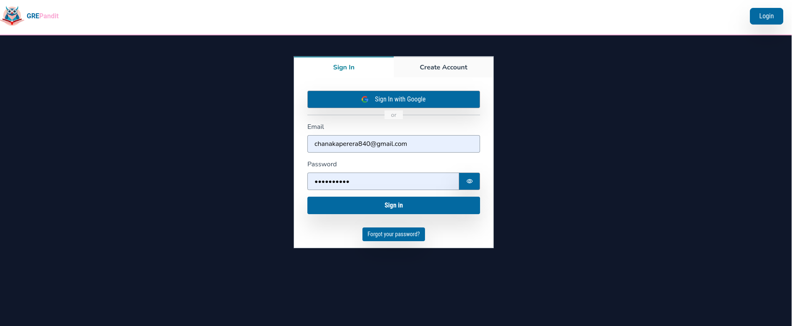
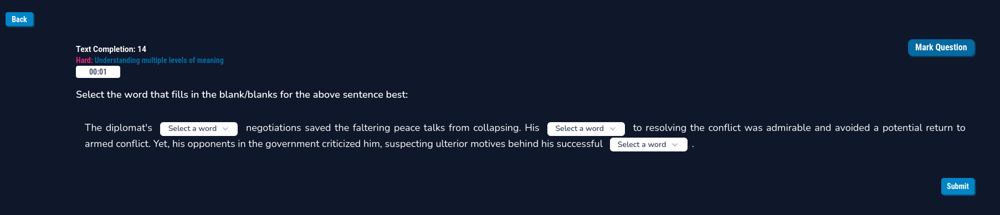
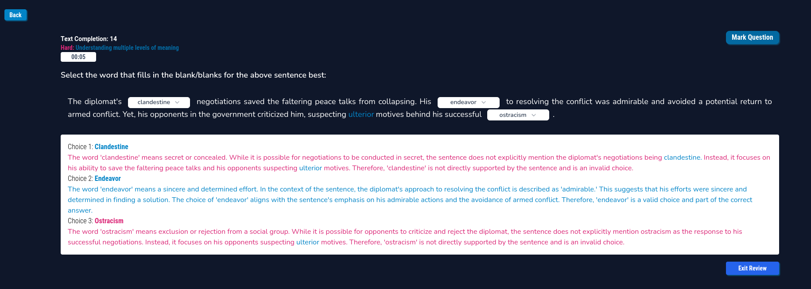
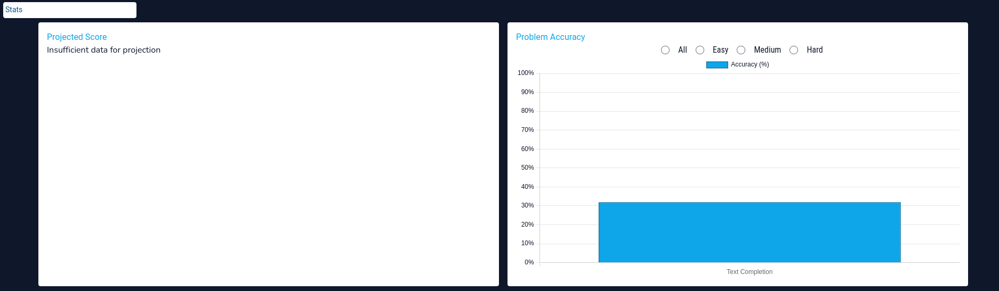

# GREPandit


Official Domain: [GREPandit](https://grepandit.com)

Backend Logic: [GREPanditAPI](https://github.com/TappingWater/GREPanditAPI)

## Overview
GREPandit is an advanced online platform designed specifically for test takers preparing for the verbal reasoning section of the GRE exam. Recognizing the challenges many face in this domain, GREPandit employs state-of-the-art artificial intelligence to auto-generate questions, simulating the intricate patterns of the actual GRE test.

But GREPandit's innovation doesn't stop there. As users interact with the platform, it meticulously collects data on their performance, pinpointing their strengths and weaknesses. This data-driven approach not only provides test-takers with detailed insights on their areas of improvement but also offers visualized statistics for a comprehensive understanding of their progress.

The aim is not just to prepare but to empower each user with the knowledge and confidence to tackle the verbal section head-on.

## Features
- Tackle a wide variety of problems tailored to mimic the actual GRE verbal reasoning section.
- Visualize your performance with detailed statistics and interactive charts.
- Mark specific problems for later review or to highlight areas of difficulty.
- Enhance your vocabulary by marking and reviewing challenging words.
- Experience adaptive questioning that adjusts based on your performance, ensuring you always face the right level of challenge.
- Review problems in-depth and understand the nuances of each question.
- Receive actionable insights on areas of improvement, helping you pinpoint exactly where you might be going wrong.
- User authentication and top-tier security powered by AWS Cognito, ensuring your data is safe and your progress is uninterrupted.

## Screenshots
### Authentication using AWS Cognito
GREPandit offers robust user authentication with both email-password combinations and Google's social sign-in. This ensures a seamless experience for users, irrespective of their preferred mode of login.


### Take Questions with Multiple Strategies
GREPandit offers users the flexibility to approach questions with various strategies, ensuring a comprehensive preparation experience.


### Taking Questions
The core feature of GREPandit is its question-taking interface. Designed with user experience in mind, it offers an intuitive layout for users to practice and hone their verbal reasoning skills.

### Reviewing Problems
For a deep-dive into areas of improvement, GREPandit allows users to review problems. This feature is especially handy to inspect challenging vocabulary or understand mistakes.


### Review Mistakes and Marked Content
Users can quickly access and review all the words and problems they've marked or answered incorrectly. This feature ensures that users can revisit and reinforce their understanding.


### Visualize Your Performance
To offer a holistic view of one's progress, GREPandit provides visual data representations. These visualizations help users gauge their performance and areas needing attention.


## Technical Details

GREPandit is powered by AWS Amplify for hosting, ensuring a scalable and reliable user experience. For user authentication, the platform integrates AWS Cognito, offering both security and flexibility.

## Installation and Setup

To get GREPandit up and running locally:

1. **Clone the Repository**:
    ```bash
    git clone repo
    ```

2. **Install NPM Packages**:
    Navigate to your project directory and run:
    ```bash
    npm install
    ```

3. **Install and Configure Amplify**:
    Install the Amplify CLI globally:
    ```bash
    npm install -g @aws-amplify/cli
    ```
    Then, configure Amplify by following the on-screen instructions:
    ```bash
    amplify configure
    ```

4. **Run the Development Server**:
    Start the local development server with:
    ```bash
    npm run dev
    ```
    The application should now be running on [localhost:3000](http://localhost:3000).
	

4. **Install the backend server**:
	Instructions can be found here: [GREPandit REST API](https://github.com/TappingWater/GREPanditAPI).

## License

This work is licensed under a Creative Commons Attribution-NonCommercial 4.0
International License. See [LICENSE](LICENSE.md) for more details.
